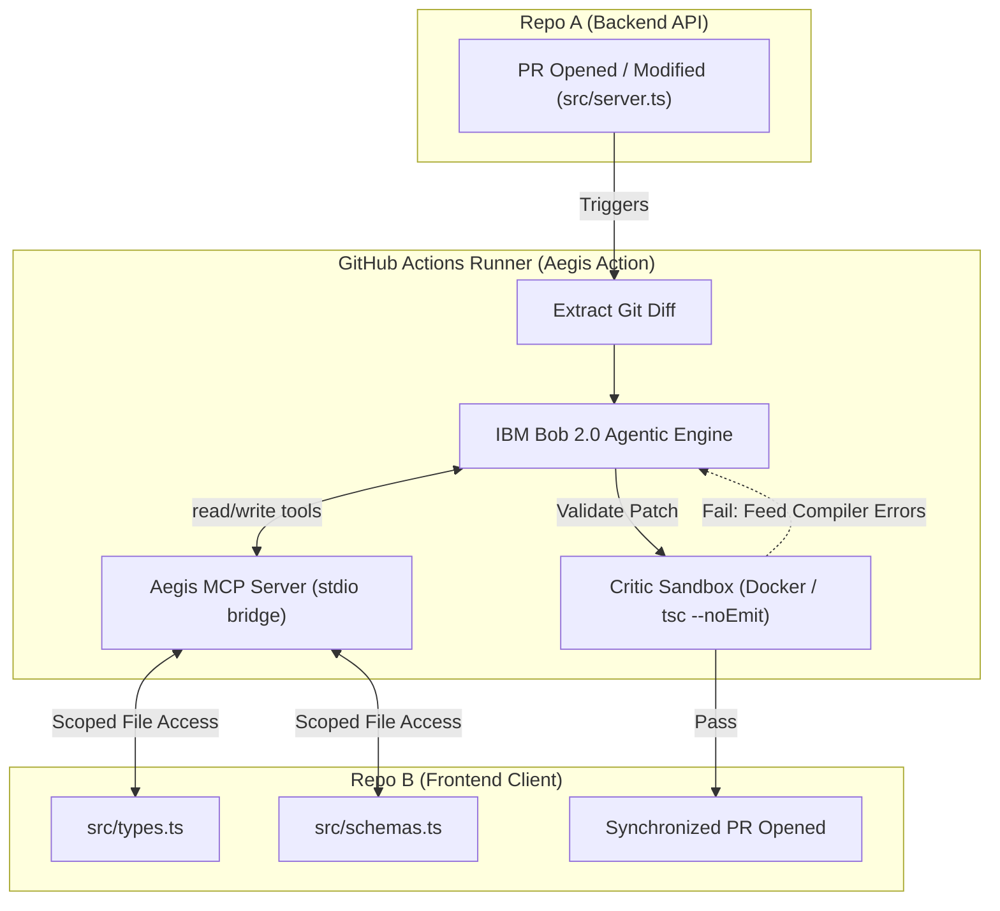
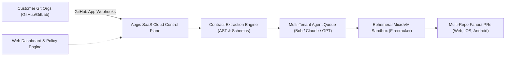

# Product Requirements Document (PRD)
## Project Aegis: Autonomous API Contract Synchronization Platform
**Subtitle:** Zero-Drift Microservices Powered by IBM Bob 2.0 & Model Context Protocol (MCP)  
**Document Version:** 2.0.0  
**Status:** Approved for Implementation (Hackathon Phase 1 + SaaS Phase 2)  
**Target Event:** IBM Bob 2.0 Hackathon (Lablab.ai)  

---

## 1. Executive Summary

In modern microservice and decoupled frontend architectures, **integration drift** is one of the most persistent and costly friction points. When a backend developer modifies an API payload, downstream frontend, mobile, and client services silently fail at runtime due to obsolete types and validation schemas.

**Project Aegis** is an autonomous CI/CD contract synchronization system. Driven by **IBM Bob 2.0** and bridged via a custom **Model Context Protocol (MCP)** server, Aegis continuously monitors backend API changes, analyzes contract breaks, generates matching TypeScript interfaces and Zod validation schemas, validates the result in an isolated sandbox, and automatically creates a synchronized pull request on the downstream client repository.

This PRD establishes the product and technical requirements for:
1. **Phase 1 (Immediate / Hackathon Scope):** A turnkey, reusable **GitHub Action and Interactive Bot** with a 1-command local simulator for judges and developers.
2. **Phase 2 (Post-Hackathon / Commercial Scope):** A multi-tenant **B2B SaaS Developer Platform** featuring a centralized GitHub App, `.aegis.yml` configuration as code, multi-language schema adapters, and ephemeral microVM sandboxes.

---

## 2. Problem Statement & Market Opportunity

### 2.1 The Problem: Integration Drift
- **Silent Failures:** TypeScript types exist only at compile-time. If an API returns `uuid` instead of `user_id`, frontend apps fail silently in production unless runtime validators (e.g., Zod) or end-to-end tests catch them.
- **Cross-Team Coordination Overhead:** Resolving a single renamed backend field often requires Slack pings, sync meetings, manual PR creation in sibling repos, and delayed deploy trains.
- **Microservice Sprawl:** In companies with dozens of microservices and multiple clients (Web, iOS, Android), keeping contracts in sync manually scales quadratically ($O(N^2)$).

### 2.2 The Solution
Project Aegis replaces manual cross-team contract synchronization with an **Autonomous Actor-Critic Agent Loop**:
- **Automated Ingestion:** Triggers directly on pull requests touching API boundaries.
- **Deep Agentic Reasoning:** IBM Bob 2.0 multi-agent architecture (Planner $\rightarrow$ Implementer $\rightarrow$ Critic) reasons over the exact semantic AST/diff.
- **Least-Privilege Bridge:** Custom MCP server restricts LLM access to allowed schema and type files, eliminating arbitrary filesystem tampering.
- **Guaranteed Correctness:** Isolated sandbox compiles and type-checks patches before any pull request is opened.

---

## 3. Personas & Stakeholders

| Persona | Role | Pain Point | Aegis Value Proposition |
| :--- | :--- | :--- | :--- |
| **Alex (Backend Dev)** | Senior Software Engineer | Hesitant to refactor API endpoints because it might break frontend or mobile apps. | Refactor fearlessly; Aegis automatically generates and tests the client-side patches. |
| **Maya (Frontend Dev)** | UI/Next.js Engineer | Spends hours debugging runtime errors caused by unexpected backend payload changes. | Receives clean, pre-tested PRs with updated types and Zod schemas matching backend changes. |
| **Sam (Engineering Lead)** | Platform / DevOps Lead | Deployments blocked by integration bugs; high coordination overhead between teams. | Eliminates integration drift, lowers bug escape rate, and provides audit trail of contract changes. |
| **Hackathon Judges** | Lablab.ai / IBM Reviewers | Reviewing dozens of projects; needs instant proof of IBM Bob 2.0 usage, clean architecture, and rapid reviewability. | Reusable GitHub Action, rich PR bot comments, architecture diagrams, and a 10-second local demo runner. |

---

## 4. Phase 1: Hackathon Scope (Turnkey GitHub Action & Bot)

### 4.1 System Architecture

### 4.2 Key Features & Requirements

#### Requirement 1: Reusable Composite GitHub Action (`action.yml`)
- **Specification:** A root-level `action.yml` enabling any repository to include Project Aegis with a simple `uses:` block.
- **Inputs:**
  - `target-repo`: GitHub repository identifier (e.g., `Aegis-Enclave/repo-b-frontend`).
  - `target-token`: GitHub Token / PAT with write access to target repository.
  - `bob-api-key`: API key for IBM Bob 2.0 (or Bob Shell CLI execution).
  - `source-file`: Path to the backend schema/API file (default: `src/server.ts`).
  - `target-files`: Comma-separated list of target schema files (default: `src/types.ts,src/schemas.ts`).
- **Outputs:**
  - `pr-url`: URL of the generated frontend pull request.
  - `sync-status`: `SYNC_COMPLETE`, `NO_DIFF`, or `FAILED`.

#### Requirement 2: The Model Context Protocol (MCP) Bridge
- **Package:** `mcp-server` running over `stdio` transport.
- **Tool 1 (`read_frontend_schema`):**
  - Inputs: `filePath` (`src/types.ts` | `src/schemas.ts`).
  - Validates path traversal (`..` protection) and allowlist checking.
  - Returns complete file content and metadata.
- **Tool 2 (`write_frontend_schema`):**
  - Inputs: `filePath`, `content`.
  - Enforces atomic file writes (temporary file write followed by `fs.rename`).
  - Strict path traversal protection.

#### Requirement 3: Multi-Agent Actor-Critic Validation Loop
- **Iteration Limit:** Up to 3 iterations.
- **Execution Flow:**
  1. **Planner Agent:** Reviews the backend PR diff and assesses impact on client contracts.
  2. **Implementer Agent:** Invokes `read_frontend_schema`, synthesizes updated TypeScript types and Zod schemas, and calls `write_frontend_schema`.
  3. **Critic Agent (Sandbox):** Runs `npm run type-check` (or containerized Docker build).
     - If compilation fails, stderr is captured and reinjected into `${TSC_ERRORS}` for the next agent prompt iteration.
     - If compilation succeeds, loop terminates immediately.

#### Requirement 4: Interactive Bot PR Experience
- **PR Status Comment:** Automatically post a rich Markdown comment on the backend PR detailing:
  - 🛡️ **Aegis Contract Sync Status** (Success / In Progress / Failed).
  - 🔍 **Detected Schema Diffs** (fields added, renamed, or modified).
  - 🤖 **Agent Execution Trace** (Planner $\rightarrow$ Implementer $\rightarrow$ Critic).
  - 🔗 **Link to Generated Client PR**.

#### Requirement 5: 1-Command Local Simulator (`npm run demo` / `aegis-cli`)
- **Problem Solved:** Enables hackathon judges and evaluators to test the full synchronization workflow locally without requiring remote GitHub credentials or webhooks.
- **Flow:**
  1. Injects a simulated breaking change into `repo-a-backend`.
  2. Executes the MCP bridge and agent prompt.
  3. Runs frontend type validation.
  4. Outputs colored before/after diffs in terminal.

---

## 5. Phase 2: Commercial SaaS Product Vision (Post-Hackathon)

### 5.1 SaaS Features & Differentiation
1. **1-Click GitHub App Onboarding:** Organization-wide installation with zero secret token management.
2. **Configuration as Code (`.aegis.yml`):** Define multi-repo contract dependencies, custom test commands, and approval rules.
3. **Polyglot Schema Adapters:** Support OpenAPI/Swagger, GraphQL, tRPC, Protobuf/gRPC, Swift (Codable), Kotlin (Data Classes), and Python (Pydantic).
4. **Multi-Repo Fanout:** A single backend breaking change automatically opens synchronized, tested PRs across Web, Mobile, and Public SDK repositories simultaneously.
5. **Zero-Trust Ephemeral Sandboxing:** Multi-tenant isolation using AWS Firecracker microVMs or rootless gVisor containers to safely execute untrusted customer build scripts.

### 5.2 Monetization & Packaging

| Tier | Target Customer | Features | Price |
| :--- | :--- | :--- | :--- |
| **Developer / OSS** | Open-source projects & individual developers | Public repos, 1 target repository, standard execution queue | Free |
| **Team (PLG)** | High-growth startups (10–50 engineers) | Private repos, unlimited syncs, 5 connected client repos, Slack alerts | $39 / active dev / month |
| **Enterprise** | Large engineering organizations | Self-hosted runner integration, SOC2 compliance, custom LLM keys (BYOK), multi-repo fanout | $1,500+ / month |

---

## 6. Hackathon Evaluation Alignment (IBM Bob 2.0 Hackathon)

| Judging Criterion | How Project Aegis Excels |
| :--- | :--- |
| **Effective Use of IBM Bob 2.0** | Uses Bob's multi-agent dynamic orchestration (Planner, Implementer, Critic) and native MCP support to bridge isolated repositories. |
| **Real-World Impact & Utility** | Solves integration drift—a multi-billion dollar friction point in microservice architectures. |
| **Technical Polish & Architecture** | Features clean TypeScript strict code, atomic MCP writes, Dockerized sandboxing, shell-safe Python injections, and comprehensive test suites. |
| **Demo & Presentation Quality** | Includes a turnkey GitHub Action, rich PR bot feedback, interactive local demo runner, and a 3-minute video script. |

---

## 7. Implementation Checklist (Hackathon Deliverables)

- [x] Backend mock API with `User` data contract ([`repo-a-backend`](file:///home/lxrdxe7o/Dev/aegis-enclave/project-aegis/repo-a-backend))
- [x] Frontend Next.js app with Zod validation & TypeScript types ([`repo-b-frontend`](file:///home/lxrdxe7o/Dev/aegis-enclave/project-aegis/repo-b-frontend))
- [x] Custom Model Context Protocol server ([`mcp-server`](file:///home/lxrdxe7o/Dev/aegis-enclave/project-aegis/mcp-server))
- [x] Actor-Critic CI workflow with retry loop ([`aegis.yml`](file:///home/lxrdxe7o/Dev/aegis-enclave/project-aegis/repo-a-backend/.github/workflows/aegis.yml))
- [ ] Root Reusable GitHub Action configuration (`action.yml`)
- [ ] Root `README.md` with badges, architecture diagrams, and submission pitch
- [ ] 1-Command local demo runner (`npm run demo` / `scripts/demo.ts`)
- [ ] PR comment visual enhancements (badges & structured diffs)
